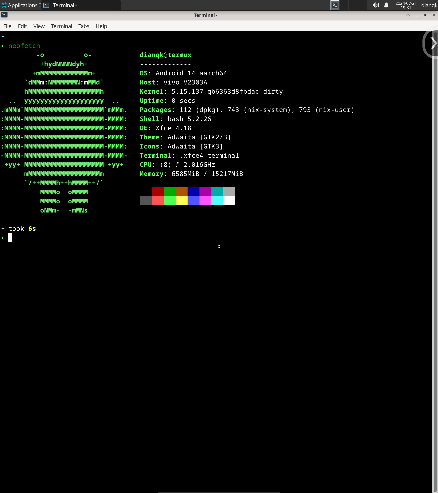
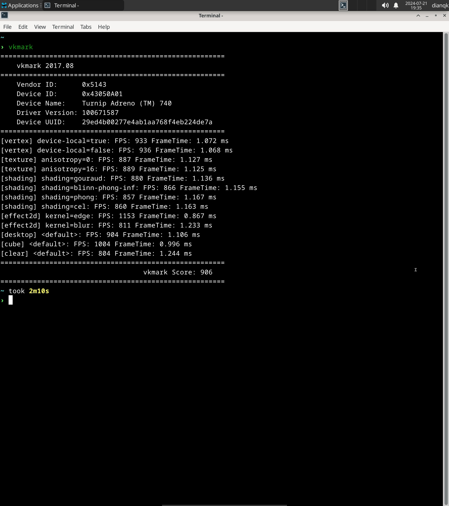
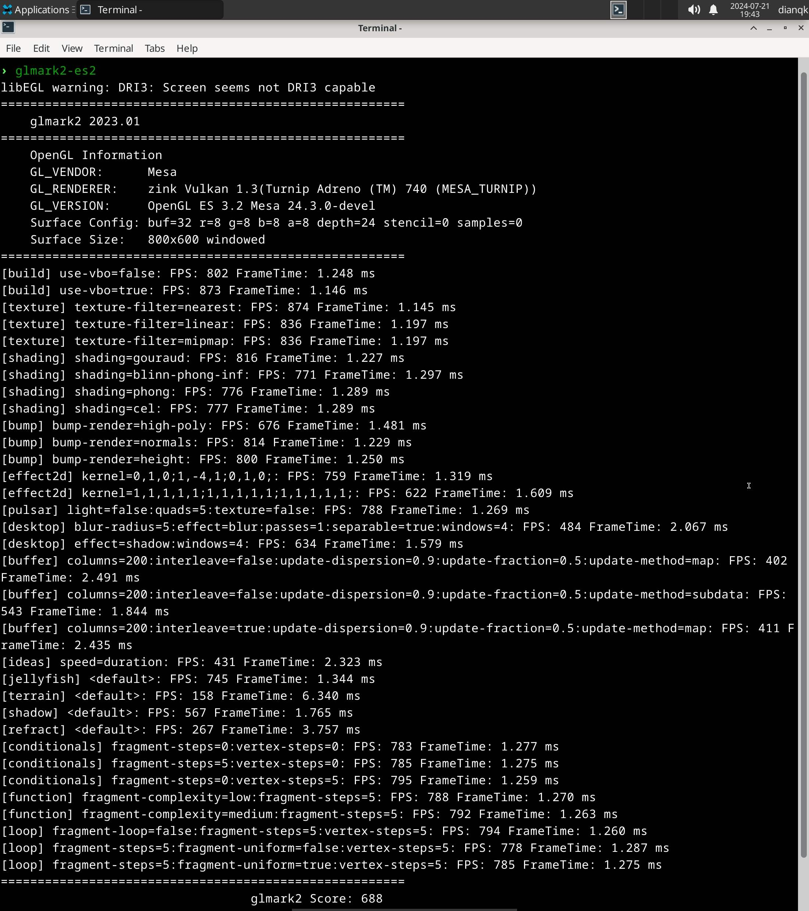
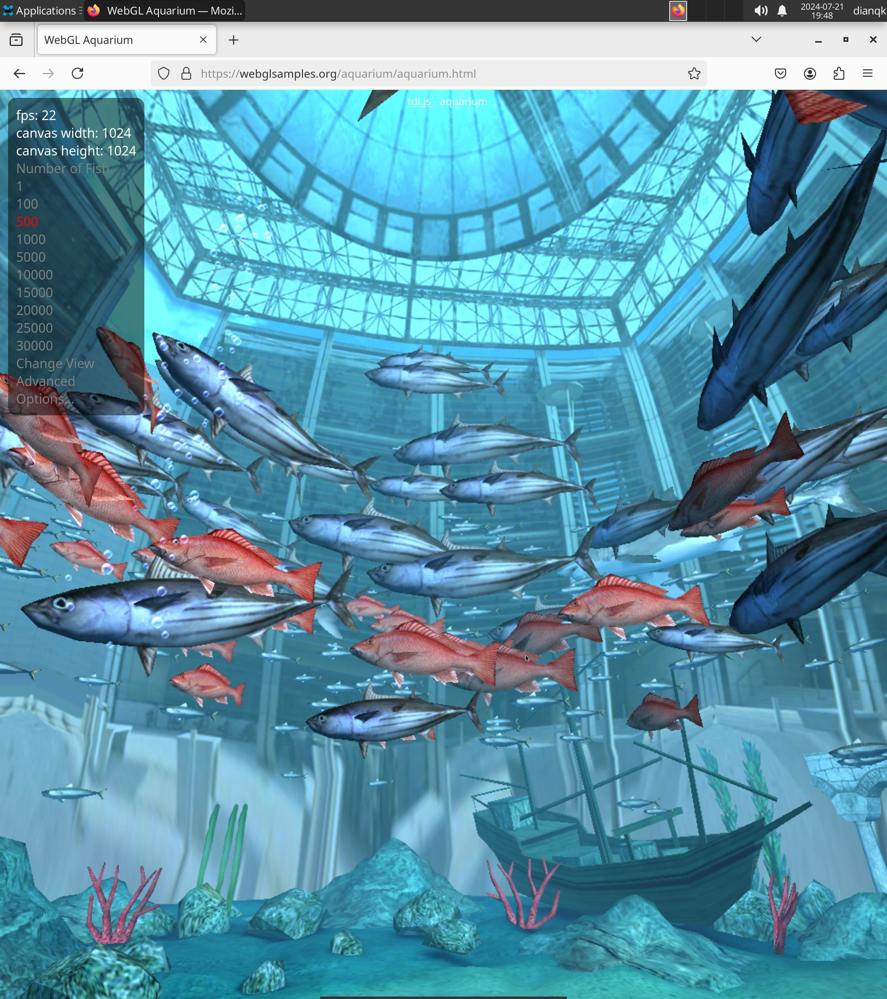

# Using Nix (proot) on Termux

## Disclaimer

- I apologize that I am not an expert in Nix or Android. You may need to resolve any issues on your own.
- This repository may alter your Termux environment, and your data might be lost.

## Install

1. Execute `export USER=your_username` to set the `USER` environment variable.
2. Exectue `./0-init-install.sh` to prepare the necessary files.
3. Exectue `./1-nix-login.sh` to enter the Nix environment.
4. Execute `./2-install-in-nix.sh` to install Nix.

## About nix-on-termux

If you are familiar with [nix-on-droid](https://github.com/nix-community/nix-on-droid), you can use the `nix-on-termux.sh` script provided in this repository to explore https://github.com/DianQK/nix-on-termux.

## My progress

- [x] xfce4
- [x] vulkan & zink (see https://github.com/MastaG/mesa-turnip-ppa)
- [x] rish (see https://github.com/RikkaApps/Shizuku)
- [x] firefox
- [ ] box64 & wine
- [ ] ...

## Screenshots

| neofetch | vkmark | glmark2-es2 | webgl |
|:--------:|:------:|:-----------:|:-----:|
|  |  |  |  |

## Credit

- [nix-on-droid](https://github.com/nix-community/nix-on-droid)
- [proot-setup#26](https://github.com/xDoge26/proot-setup/issues/26)
- [mesa-turnip-ppa](https://github.com/MastaG/mesa-turnip-ppa)
- [Termux-Desktops](https://github.com/LinuxDroidMaster/Termux-Desktops)
